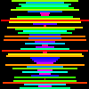

### Ordenação com gif do passo a passo

Programa recebe um inteiro N, cria um vetor com N
elementos variando de 0 a N-1, posteriormente embaralha
os valores e chama a função de ordenação. 

Dentro da função de ordenação, além de ordenar, também
é criado um gif, sempre que swap é chamado, logo em seguida
adiciona-se um novo frame ao gif com o estado atual do vetor.

O resultado é um gif (dimensão NxN) que pega uma sequência 
de cores desordenada e a ordena para formar o espectro de cores.

Para usar o programa usar os seguintes comandos:

> make all

> make run

O programa espera que seja inserido um inteiro positivo que
representa a quantidade de cores (ou valores que serão ordenados).
Também espera um inteiro positivo que será o tamanho no gif. 
Por exemplo, quando inserido 100, o gif resultante terá 
dimensões 100x100.

Recomenda-se que o valor N seja entre 10 a 100. A medida que 
aumenta a quantidade de frames do gif também aumenta o tempo 
de execução, programa fica bem lento (a visualização 
final também).

Exemplo de gif gerado com N = 50 e M = 100:

Foi utilizado o projeto [gifenc](https://github.com/lecram/gifenc). 
